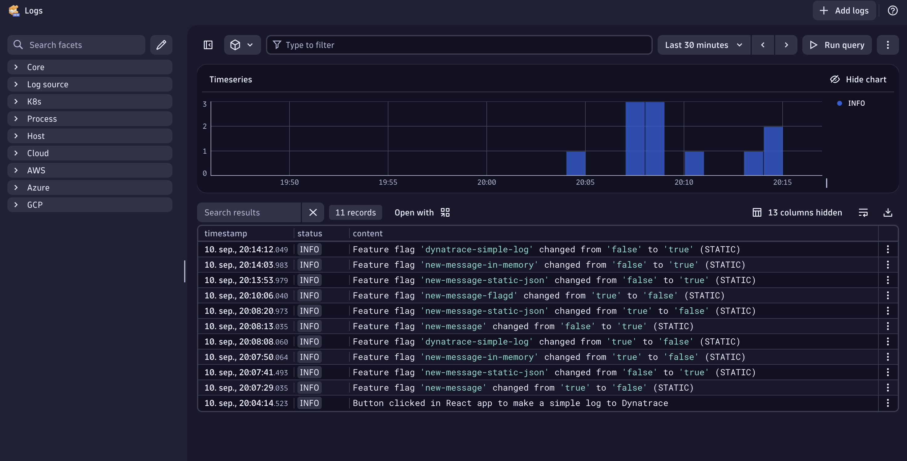

# OpenFeature with React, OpenTelemetry and Dynatrace [Work in progress]

## Purpose

This repository showcases how to use OpenFeature and OpenTelemetry SDK in a React frontend application to send feature flag data to Dynatrace, where you can observe and monitor the changes in real-time.

A demonstration of OpenFeature integration with React, showing different feature flag providers and their connection to the Dynatrace platform for observability and monitoring.

## Implementation

This project demonstrates three different OpenFeature providers:

1. **In-Memory Provider** - Feature flags stored in memory
2. **Static JSON Provider** - Feature flags loaded from a static JSON file
3. **Flagd Provider** - Feature flags served from a flagd instance running in Docker

## Project Structure

- `src/components/` - React components for each provider
- `src/openFeature/` - Custom providers and hooks
- `flagd-provider/` - Docker configuration for flagd
- `proxy/` - Local proxy server for development

## Getting Started

1. **Create environment configuration:**

   Create a `.env` file in the root directory with your Dynatrace credentials:

   ```bash
   VITE_DYNATRACE_ENDPOINT=https://your-environment-id.live.dynatrace.com/api/v2/logs/ingest
   VITE_DYNATRACE_API_TOKEN=your-dynatrace-api-token
   ```

2. **Install dependencies:**

   ```bash
   npm install
   ```

3. **Start the flagd provider:**

   ```bash
   cd flagd-provider
   docker-compose up -d
   ```

4. **Run the development server with proxy:**
   ```bash
   npm run dev:full
   ```

## Roadmap

- [x] Complete OpenTelemetry integration
- [x] Connect to Dynatrace platform
- [ ] Replace placeholder UI with a more polished one

## Technologies Used

- React 19.1.1
- OpenFeature React SDK 1.0.1
- OpenFeature Flagd Web Provider 0.7.3
- Flagd 0.12.9 (Docker)
- OpenTelemetry SDK 2.0.1
- TypeScript 5.8.3
- Vite 7.1.4
- Node.js + Express 4.21.2 (Proxy Server - handles CORS and forwards logs to Dynatrace)

## Dynatrace Integration

The application sends feature flag change events to Dynatrace, allowing you to monitor and observe flag state changes in real-time through the Dynatrace Logs interface.


